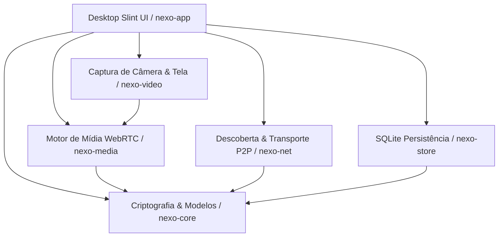

# Nexo

[](LICENSE)
[](https://www.rust-lang.org/)
[](https://slint.dev/)

**Nexo** é um aplicativo de comunicação ponto-a-ponto (P2P) nativo, local-first e de código aberto (AGPL-3.0), projetado para Windows e Linux. Cada instalação opera simultaneamente como cliente e nó de rede autônomo, permitindo comunicação de texto, voz, vídeo e compartilhamento de tela em rede local (LAN), sem dependência de servidores centrais obrigatórios ou runtimes pesados de navegador (sem Electron).

---

## 🌟 Princípios de Design

- **100% Nativo e Leve**: Construído em Rust e interface gráfica Slint compilada nativamente com aceleração por GPU/software, sem Electron ou WebViews.
- **Offline e Local-First por Design**: Descoberta e operação completas em LAN via mDNS, independente de conexão com a internet ou servidores DNS externos.
- **Verificação Criptográfica Ponta a Ponta**: Identidades persistentes Ed25519; todas as mensagens, convites de comunidade e sinais de chamada são assinados digitalmente.
- **Topologia participante**: Chamadas pequenas usam WebRTC P2P direto; quando há relay, as métricas assinadas elegem um participante, mantêm reserva, enviam heartbeat e migram a rota sem derrubar as conexões antigas.
- **Criptografia de Mídia Acima do Transporte**: Opus, VP8 e H.264 são cifrados acima de DTLS/SRTP; o participante relay encaminha envelopes autenticados sem receber o conteúdo em claro.

---

## 🏗️ Arquitetura do Workspace

O projeto é estruturado em uma arquitetura modular de crates Rust:

| Crate | Responsabilidade |
| :--- | :--- |
| [`crates/nexo-core`](crates/nexo-core) | Identidades Ed25519, convites assinados, credenciais de membros, mensagens, sinais de chamada, topologia SFU, Double Ratchet (DMs 1-a-1), estado de associação inspirado em MLS e cifra de mídia E2E (`MediaFrameCipher`). |
| [`crates/nexo-store`](crates/nexo-store) | Persistência local em SQLite, múltiplos canais de texto e voz, paginação offline, recibos de entrega, transferências de arquivos e proteção contra replay. |
| [`crates/nexo-net`](crates/nexo-net) | Transporte de rede libp2p (TCP/QUIC), autenticação Noise, descoberta mDNS/Kademlia opcional, protocolo de sinalização autenticado e transferências P2P. |
| [`crates/nexo-video`](crates/nexo-video) | Captura de câmera (Media Foundation no Windows / V4L2 no Linux), captura de tela (Windows Graphics Capture / XDG Portal + PipeWire), sondagem de aceleração, encoder H.264 MFT no Windows e VA-API opcional no Linux. |
| [`crates/nexo-media`](crates/nexo-media) | Sessões WebRTC (DTLS/SRTP/SCTP), canais de dados, codecs Opus/VP8 e receptor H.264, limite de bitrate por feedback REMB, DSP (AEC/Noise Suppression) e tons procedurais. |
| [`crates/nexo-app`](crates/nexo-app) | Interface desktop nativa em Slint, orquestração de chamadas, catálogo dinâmico de dispositivos, Markdown rico, emojis e integração com a bandeja do sistema (Tray). |



---

## 🚀 Funcionalidades Implementadas

- [x] **Identidade e Segurança**: Chaves Ed25519 salvas localmente, mensagens e sinais de presença assinados e verificados.
- [x] **Comunidades e Mensagens Offline**: Criação e entrada por convites assinados com expiração, sincronização automática ao reconectar.
- [x] **Múltiplos Canais de Texto & Voz**: A interface permite selecionar e criar canais tipados; os metadados e as mensagens são sincronizados entre os membros autorizados.
- [x] **Mensagens Diretas com Double Ratchet**: Conversas 1-a-1 aparecem na interface, usam sinais LAN autenticados, envelope Ed25519, Double Ratchet X25519/ChaCha20-Poly1305, deduplicação e persistência local. Envelopes cifrados pendentes são paginados e confirmados após reconexão, sem transmitir texto em claro.
- [~] **Associação e mensagens inspiradas em MLS**: convites novos carregam um segredo de grupo aleatório, commits assinados de entrada/remoção e epochs são persistidos/sincronizados, e mensagens novas usam envelopes ChaCha20-Poly1305 associados ao epoch. O fundador pode revogar membros pela interface; commits de remoção distribuem a nova chave de epoch em envelopes X25519 individuais e a chamada é rekeyada. A interoperabilidade RFC 9420 e key packages padrão continuam em evolução.
- [x] **Descoberta LAN/WAN opcional**: Descoberta automática de pares na rede local via mDNS;
  quando `NEXO_KAD_BOOTSTRAP` é configurado com endereços autenticados separados por `;`, o
  Kademlia opcional aprende endereços adicionais sem tornar qualquer servidor obrigatório.
- [x] **Transferência P2P de Arquivos**: Em uma chamada ativa, anexos e notas usam o DataChannel WebRTC autenticado, com blocos limitados, hash SHA-256 e oferta assinada Ed25519; fora da chamada, o transporte libp2p de 64 KB continua como fallback.
- [x] **Notas de Voz**: Captura local PCM mono de 48 kHz por até 60 segundos, conversão para WAV e envio pelo mesmo caminho WebRTC quando a chamada cobre todos os destinatários.
- [x] **Markdown Rico & Emojis**: Formatação em tempo real no chat (negrito, itálico, código inline, blocos de código e shortcodes de emoji).
- [x] **Voz WebRTC P2P**: Áudio Opus (20 ms, VBR, FEC, DTX), troca de microfone/alto-falante a quente sem queda de chamada e buffer de jitter.
- [x] **Vídeo WebRTC P2P**: Captura de câmera e tela, conversão para I420, codec VP8 autocontido e empacotamento RTP. O transporte também aceita H.264; um encoder MFT síncrono ou assíncrono é selecionado quando ambos os peers anunciam suporte, com fallback automático para VP8. O caminho assíncrono usa um worker de eventos dedicado e mantém timestamps e quadros-chave mesmo com a latência do driver.
- [x] **Qualidade de Vídeo Adaptativa**: O caminho WebRTC consome estimativas REMB de RTCP, ajusta o limite dos remetentes sem renegociação e alterna entre perfis de 360p/15 FPS, 480p/24 FPS e 720p/30 FPS, recriando o encoder somente quando a faixa muda.
- [x] **Áudio DSP Avançado**: A captura de voz usa supressão de ruído e AEC/NLMS quando há referência de playback; a referência atual é o último frame enviado ao dispositivo de saída.
- [x] **Sintetizador de Sons Procedurais**: Toques de chamada telefônica e chimes de notificação gerados puramente em código sem arquivos externos.
- [x] **Topologia SFU & E2E Crypto**: Relay participante com eleição por métricas, standby, heartbeat, failover/migração make-before-break e cifra E2E acima do WebRTC. Publicadores relay usam slots de vídeo próprios; o transporte valida encaminhamento de quatro publicadores para dois assinantes, enquanto a validação de carga multipublisher entre máquinas físicas ainda está no roadmap.
- [x] **Suporte opcional a NAT Traversal**: O WebRTC aceita STUN/TURN e a sinalização libp2p aceita Circuit Relay v2 com DCUtR por configuração de ambiente; sem servidores configurados, a descoberta e a conexão direta em LAN continuam funcionando sem internet.
- [x] **Interface Slint Desktop**: Navegação em comunidades, canais, painel de chamada com visualização de vídeo local e remoto, lista de participantes e seletores de microfone, saída e câmera.
- [x] **Bandeja do Sistema (System Tray)**: Ícone nativo Slint no Windows e Linux, com ações para
  restaurar a janela e sair; fechar a janela a esconde enquanto a presença de rede permanece ativa.
- [x] **Empacotamento Nativo**: Scripts reproduzíveis geram ZIP portátil para Windows x86_64 e
  tarball/.deb para Linux x86_64; a validação física de câmera, tela e GPU continua separada.

---

## 🛠️ Compilação e Testes

### Pré-requisitos
- **Rust** 1.88 ou superior (toolchain estável ou GNU).
- No Windows: Toolchain `x86_64-pc-windows-gnu` ou `x86_64-pc-windows-msvc`.
- No Linux (Ubuntu/Debian):
  ```bash
  sudo apt update && sudo apt install -y build-essential pkg-config libclang-dev libv4l-dev libasound2-dev
  ```

### Executando Testes
Para rodar toda a suíte de testes do workspace:
```bash
cargo test --workspace
```

### Verificação Estrita de Formatação e Lints
```bash
cargo fmt --all --check
cargo clippy --workspace --all-targets -- -D warnings
```

### Executando o Aplicativo
```bash
cargo run -p nexo-app
```

Para gerar os pacotes com os testes e verificações da pipeline, use `scripts/build-all.sh` no Linux
ou `scripts/build-all.ps1` no Windows. A toolchain é opcional e não fica presa a um caminho local:

```powershell
.\scripts\build-all.ps1 -Version v1.0.0 -Toolchain 1.97.1-x86_64-pc-windows-gnu
```

Sem `-Toolchain`, o Windows usa a toolchain padrão do `rustup`. `-OutDir` também pode receber um
caminho absoluto, útil para ambientes de CI com workspace somente leitura.

Para uma rede fora da LAN, configure um ou mais peers de bootstrap alcançáveis (o endereço deve
terminar em `/p2p/<PeerId>`):

```text
NEXO_KAD_BOOTSTRAP=/ip4/203.0.113.10/tcp/4242/p2p/12D3KooW...;/ip4/198.51.100.4/udp/4242/quic-v1/p2p/12D3KooW...
```

Para redes com NAT restritivo, configure também um ou mais relays Circuit Relay v2
alcançáveis. O endereço deve terminar em `/p2p/<PeerId>` e os valores são separados por `;`:

```text
NEXO_RELAY_SERVERS=/ip4/203.0.113.20/tcp/4001/p2p/12D3KooW...
```

O Nexo reserva automaticamente um endereço `/p2p-circuit` no relay e tenta fazer DCUtR para
voltar ao caminho direto. A implantação e a escolha do servidor relay continuam sendo uma
responsabilidade do operador; nenhum servidor externo é obrigatório para a rede local.

Qualquer instalação também pode hospedar relay v2, de forma opt-in e com limites de capacidade:

```text
NEXO_RELAY_SERVER=1
NEXO_RELAY_LISTEN_PORT=4001
NEXO_RELAY_PUBLIC_ADDRESS=/ip4/203.0.113.20/tcp/4001
```

Nesse modo, encaminhe a porta TCP/UDP escolhida no roteador e distribua aos participantes o
endereço autenticado dessa instalação. `NEXO_RELAY_PUBLIC_ADDRESS` é opcional para testes/LAN,
mas deve apontar para o endereço público encaminhado quando o relay for usado fora da rede local.
O modo servidor fica desligado por padrão.

Esse recurso é opcional. Sem a variável, a descoberta mDNS e os convites por endereço continuam
funcionando offline na rede local.

### Exemplos e Probes de Mídia
```bash
# Teste de saída de áudio WASAPI/ALSA:
cargo run -p nexo-media --example output_silence

# Sondagem de câmeras, GPU e aceleração de codecs:
cargo run -p nexo-video --example capabilities

# Preview de captura de câmera:
cargo run -p nexo-video --example capture_preview

# Captura de tela:
cargo run -p nexo-video --example capture_screen
```

---

## 📖 Documentação

- [Arquitetura Geral](docs/architecture.md)
- [Protocolo e Sinalização](docs/protocol.md)
- [Modelo de Ameaças e Segurança](docs/threat-model.md)
- [Roadmap de Desenvolvimento](docs/roadmap.md)
- [Registro de Continuação e Checkpoints](docs/continuation.md)

---

## 📄 Licença

Este projeto é licenciado sob a **AGPL-3.0-or-later**. Consulte o arquivo [LICENSE](LICENSE) para mais informações.
