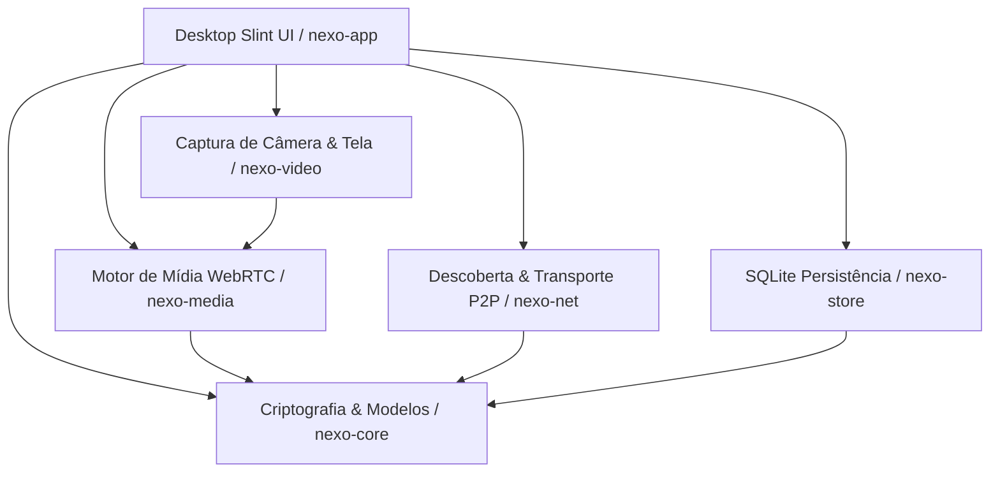

# Nexo

[](LICENSE)
[](https://www.rust-lang.org/)
[](https://slint.dev/)

**Nexo** é um aplicativo de comunicação ponto-a-ponto (P2P) nativo, local-first e de código aberto (AGPL-3.0), projetado para Windows e Linux. Cada instalação opera simultaneamente como cliente e nó de rede autônomo, permitindo comunicação de texto, voz, vídeo e compartilhamento de tela em rede local (LAN) ou pela internet sem dependência de servidores centrais obrigatórios ou runtimes pesados de navegador (sem Electron).

---

## 🌟 Princípios de Design

- **100% Nativo e Leve**: Construído em Rust e interface gráfica Slint compilada nativamente com aceleração por GPU/software, sem Electron ou WebViews.
- **Offline e Local-First por Design**: Descoberta e operação completas em LAN via mDNS, independente de conexão com a internet ou servidores DNS externos.
- **Verificação Criptográfica Ponta a Ponta**: Identidades persistentes Ed25519; todas as mensagens, convites de comunidade e sinais de chamada são assinados digitalmente.
- **Topologia Progressiva e Adaptativa**: Malha WebRTC P2P direta para pequenas chamadas (2 a 4 participantes) e eleição determinística de nó participante como SFU com migração *make-before-break* para grupos maiores.
- **Criptografia de Mídia Acima do Transporte**: Cifra de quadros em camadas para que nós roteadores SFU não consigam decodificar os fluxos de áudio e vídeo de outros participantes.

---

## 🏗️ Arquitetura do Workspace

O projeto é estruturado em uma arquitetura modular de crates Rust:

| Crate | Responsabilidade |
| :--- | :--- |
| [`crates/nexo-core`](crates/nexo-core) | Identidades Ed25519, convites assinados, credenciais de membros, mensagens, sinais de chamada, topologia SFU, Double Ratchet (DMs 1-a-1), TreeKEM MLS e cifra de mídia E2E (`MediaFrameCipher`). |
| [`crates/nexo-store`](crates/nexo-store) | Persistência local em SQLite, múltiplos canais de texto e voz, paginação offline, recibos de entrega, transferências de arquivos e proteção contra replay. |
| [`crates/nexo-net`](crates/nexo-net) | Transporte de rede libp2p (TCP/QUIC), autenticação Noise, descoberta mDNS, protocolo de sinalização autenticado e transferências P2P. |
| [`crates/nexo-video`](crates/nexo-video) | Captura de câmera (Media Foundation no Windows / V4L2 no Linux), captura de tela (Windows Graphics Capture / XDG Portal + PipeWire) e sondagem de aceleração de hardware. |
| [`crates/nexo-media`](crates/nexo-media) | Sessões WebRTC (DTLS/SRTP), codec Opus puro, codec VP8 autocontido, controle adaptativo de taxa de bits (AIMD), DSP (AEC/Noise Suppression) e tons procedurais. |
| [`crates/nexo-app`](crates/nexo-app) | Interface desktop nativa em Slint, orquestração de chamadas, catálogo dinâmico de dispositivos, Markdown rico, emojis e integração com a bandeja do sistema (Tray). |



---

## 🚀 Funcionalidades Implementadas

- [x] **Identidade e Segurança**: Chaves Ed25519 salvas localmente, mensagens e sinais de presença assinados e verificados.
- [x] **Comunidades e Mensagens Offline**: Criação e entrada por convites assinados com expiração, sincronização automática ao reconectar.
- [x] **Múltiplos Canais de Texto & Voz**: Suporte a criar canais de texto (`#geral`, `#anuncios`) e salas de voz simultâneas (`🔊 Sala 1`, `🔊 Sala 2`).
- [x] **Mensagens Diretas com Double Ratchet**: Conversas 1-a-1 com sigilo futuro perfeito (PFS - *Perfect Forward Secrecy*) e recuperação contra invasão.
- [x] **Criptografia de Grupo MLS (RFC 9420)**: Estrutura em árvore *TreeKEM* para escala assimétrica $O(\log N)$ e rotação automática de segredos de época.
- [x] **Descoberta LAN**: Descoberta automática de pares na rede local via mDNS.
- [x] **Transferência P2P de Arquivos**: Envio e recebimento de mídias/arquivos em pedaços de 64 KB com hashing SHA-256 e assinatura Ed25519.
- [x] **Markdown Rico & Emojis**: Formatação em tempo real no chat (negrito, itálico, código inline, blocos de código e shortcodes de emoji).
- [x] **Voz WebRTC P2P**: Áudio Opus (20 ms, VBR, FEC, DTX), troca de microfone/alto-falante a quente sem queda de chamada e buffer de jitter.
- [x] **Vídeo WebRTC P2P**: Captura de câmera e tela, conversão para I420, codec VP8 autocontido e empacotamento RTP.
- [x] **Controle de Congestionamento & Bitrate Adaptativo**: Algoritmo AIMD avaliando RTT, perda de pacotes e jitter para ajuste dinâmico de bitrate, FPS e resolução.
- [x] **Áudio DSP Avançado**: Cancelamento de Eco Acústico (AEC com filtro adaptativo NLMS), Supressão de Ruído de Fundo (RMS) e Detecção de Atividade Vocal (VAD).
- [x] **Sintetizador de Sons Procedurais**: Toques de chamada telefônica e chimes de notificação gerados puramente em código sem arquivos externos.
- [x] **Topologia SFU & E2E Crypto**: Eleição determinística de nó hospedeiro por capacidade de rede/hardware, failover automático de standby por heartbeat e cifra autenticada para pacotes de mídia.
- [x] **Suporte a NAT Traversal**: Conexão entre redes diferentes via servidores STUN/TURN opcionais, mantendo operação 100% LAN por padrão.
- [x] **Interface Slint Desktop**: Navegação em comunidades, canais, painel de chamada com visualização de vídeo local e remoto, lista de participantes e seletores de microfone, saída e câmera.
- [x] **Bandeja do Sistema (System Tray)**: Controlador de estado em segundo plano para chamadas e presença.
- [x] **Empacotamento Nativo**: Scripts de build e empacotamento para Windows (`.zip` portátil) e Linux (`.deb` / `.tar.gz` com `.desktop` entry) e pipeline automatizado no GitHub Actions.

---

## 🛠️ Compilação e Testes

### Pré-requisitos
- **Rust** 1.88 ou superior (toolchain estável ou GNU).
- No Windows: Toolchain `x86_64-pc-windows-gnu` ou `x86_64-pc-windows-msvc`.
- No Linux (Ubuntu/Debian):
  ```bash
  sudo apt update && sudo apt install -y build-essential pkg-config libv4l-dev libasound2-dev
  ```

### Executando Testes
Para rodar toda a suíte de testes do workspace:
```bash
cargo test --workspace
```

### Verificação Estrita de Formatação e Lints
```bash
cargo fmt --all --check
cargo clippy --workspace --all-targets -- -D warnings
```

### Executando o Aplicativo
```bash
cargo run -p nexo-app
```

### Exemplos e Probes de Mídia
```bash
# Teste de saída de áudio WASAPI/ALSA:
cargo run -p nexo-media --example output_silence

# Sondagem de câmeras, GPU e aceleração de codecs:
cargo run -p nexo-video --example capabilities

# Preview de captura de câmera:
cargo run -p nexo-video --example capture_preview

# Captura de tela:
cargo run -p nexo-video --example capture_screen
```

---

## 📖 Documentação

- [Arquitetura Geral](docs/architecture.md)
- [Protocolo e Sinalização](docs/protocol.md)
- [Modelo de Ameaças e Segurança](docs/threat-model.md)
- [Roadmap de Desenvolvimento](docs/roadmap.md)
- [Registro de Continuação e Checkpoints](docs/continuation.md)

---

## 📄 Licença

Este projeto é licenciado sob a **AGPL-3.0-or-later**. Consulte o arquivo [LICENSE](LICENSE) para mais informações.
